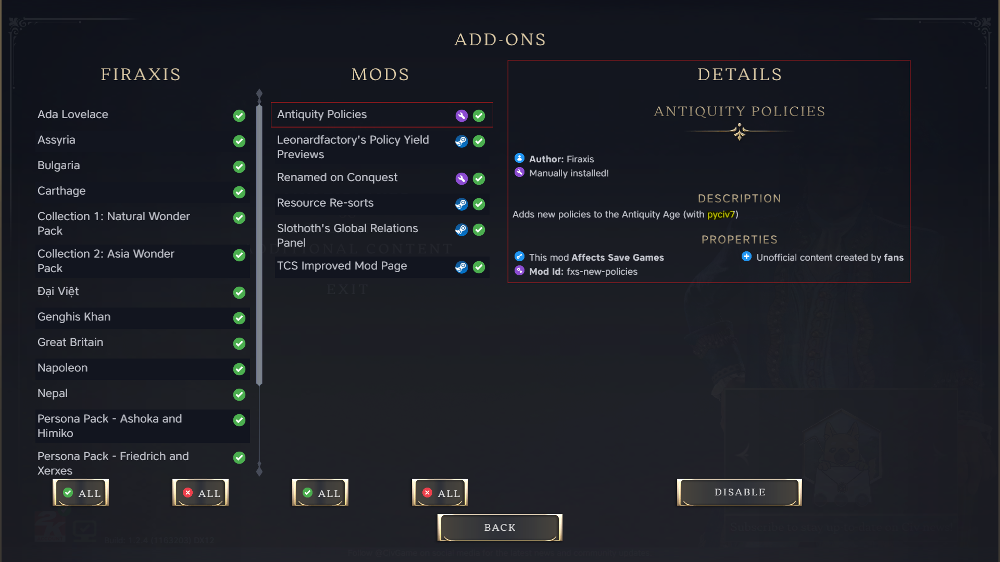

<!-- markdownlint-disable ul-indent -->
# Basic Mod

This guide walks you through creating and running a simple Civ VII mod with **pyciv7**, replicating the sample `.modinfo` from the Civ VII Development Tools guide.

!!! abstract "What you'll do"
    1. Set up a minimal repo in the Civ VII `Mods` directory  
    2. Add one XML data file  
    3. Create a tiny Python runner that builds the `.modinfo` and launches the game in debug mode

## Repository Setup

We'll place our example under the Civ VII **settings directory** (where the game reads local mods). To print that path on your machine:

```bash
uv run --with pyciv7 python -c "from pyciv7.settings import Settings; print(Settings().civ7_settings_dir)"
```

!!! failure "If this command fails"
    If you see the follow exception raised:

    > `FileNotFoundError: Cannot determine the common location of Civilization VII's installation on <your_system>. Manually set this path via CIV7_SETTINGS_DIR`

    As the error suggests, you will need to set the `CIV7_SETTINGS_DIR` environment variable to the path of your Civ VII settings directory. See the [**Build & Run**](building-and-running-a-mod.md) guide for more information on environment overrides.

Inside that directory, ensure a `Mods/` folder exists, then create a new mod folder, `fxs-new-policies/`.

!!! info
    Keeping the repo inside `Mods/` lets Civ VII pick it up immediately after we build. If you prefer your own workspace you can keep the repo elsewhere and symlink/copy the build artifacts into `Mods/`.

## Add the Data File

In `fxs-new-policies/`, create `data/antiquity-traditions.xml`. You can paste the sample content from the Dev Tools guide or a minimal stub you want to load. The path **must** match what you reference in the `.modinfo` (below).

## Creating the Runner Script

We'll use a standalone `uv` script so you don't need a full Python project. Initialize the script and add `pyciv7` as a dependency:

```bash
uv init --script run_fxs_new_policies.py
uv add --script run_fxs_new_policies.py pyciv7
```

!!! Note
    At this point, your mod file structure should look like this:

    ```pgsql
    <SettingsDir>/
      └─ Mods/
          └─ fxs-new-policies/
              ├─ run_fxs_new_policies.py
              └─ data/
                  └─ antiquity-traditions.xml
    ```

Now edit `run_fxs_new_policies.py` to build the mod and run the game:

```python
# /// script
# requires-python = ">=3.9,<3.14"
# dependencies = [
#     "pyciv7",
# ]
# ///

from pyciv7 import Mod, run
from pyciv7.modinfo import (
    Properties, Criteria, ActionGroup, UpdateDatabase, AgeInUse
)

# Define the mod (equivalent to a .modinfo tree)
mod = Mod(
    id="fxs-new-policies",
    version="1",
    properties=Properties(
        name="Antiquity Policies",
        description="Adds new policies to the Antiquity Age (with pyciv7)",
        authors="Firaxis",
        affects_saved_games=True,
    ),
    action_criteria=[
        Criteria(
            id="antiquity-age-current",
            conditions=[AgeInUse(age="AGE_ANTIQUITY")],  # <AgeInUse>AGE_ANTIQUITY</AgeInUse>
        )
    ],
    action_groups=[
        ActionGroup(
            id="antiquity-game",
            scope="game",
            criteria="antiquity-age-current",
            actions=[UpdateDatabase(items=["data/antiquity-traditions.xml"])],
        )
    ],
)

# Build the .modinfo next to this script and launch Civ VII in debug mode
# overwrite=True will regenerate the .modinfo each run
run(mod, debug=True, overwrite=True)
```

!!! note
    Running the script will create a `.modinfo` in the folder. It will look similar to this:

    ```xml
    <?xml version="1.0" encoding="utf-8"?>
    <Mod id="fxs-new-policies" version="1" xmlns="ModInfo">
    <Properties>
        <Name>Antiquity Policies</Name>
        <Description>Adds new policies to the Antiquity Age (with pyciv7)</Description>
        <Authors>Firaxis</Authors>
        <AffectsSavedGames>1</AffectsSavedGames>
    </Properties>
    <ActionCriteria>
        <Criteria id="antiquity-age-current">
        <AgeInUse>AGE_ANTIQUITY</AgeInUse>
        </Criteria>
    </ActionCriteria>
    <ActionGroups>
        <ActionGroup id="antiquity-game" scope="game" criteria="antiquity-age-current">
        <Actions>
            <UpdateDatabase>
            <Item>data/antiquity-traditions.xml</Item>
            </UpdateDatabase>
        </Actions>
        </ActionGroup>
    </ActionGroups>
    </Mod>
    ```

## Run it

From inside `fxs-new-policies/`:

```bash
uv run --script run_fxs_new_policies.py
```

Civ VII will launch in **debug** mode. In the **Main Menu**, go to **Mods** and you should see *Antiquity Policies* listed and enabled.



!!! question "Troubleshooting"
    - **Mod doesn't appear**: Confirm your `.modinfo` file is in the same folder as the script and named `.modinfo`. Ensure you placed the repo under the settings `Mods/` folder printed earlier.
    - **Path errors**: Double-check the `<Item>` path: it must be `data/antiquity-traditions.xml` and that file must exist.
    - **Civ VII settings/installation/release executable not found**: On some setups you may need to configure environment variables to tell **pyciv7** where to locate Civ VII's settings, installation, and release executable. See the [**Build & Run**](building-and-running-a-mod.md) guide for environment overrides.
    - **XML typing issues**: **pyciv7** models use [Pydantic](https://docs.pydantic.dev/) (strict types). If you pass the wrong type/value, the build will fail with a clear validation error.
